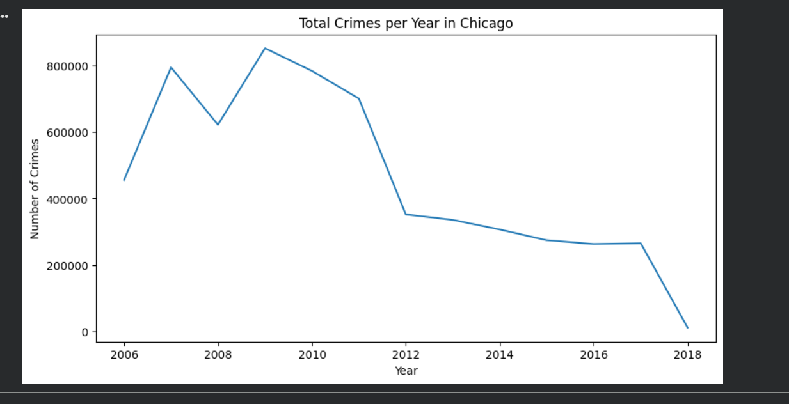
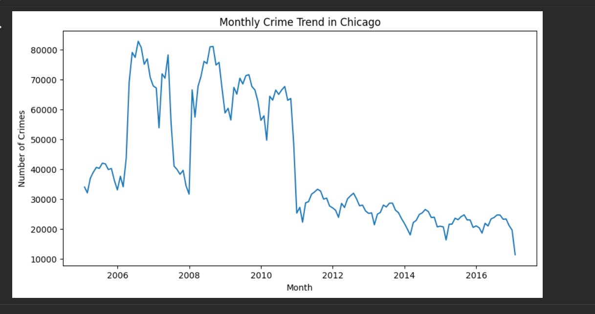
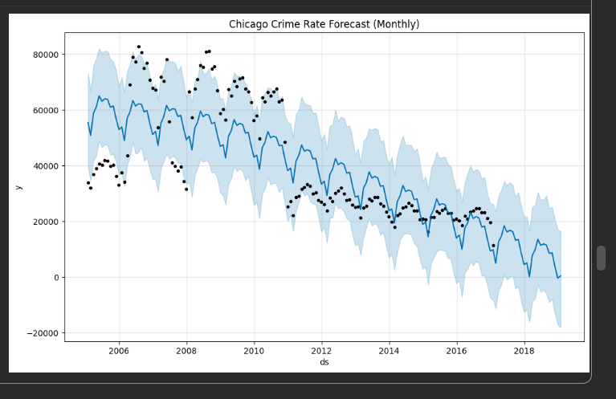
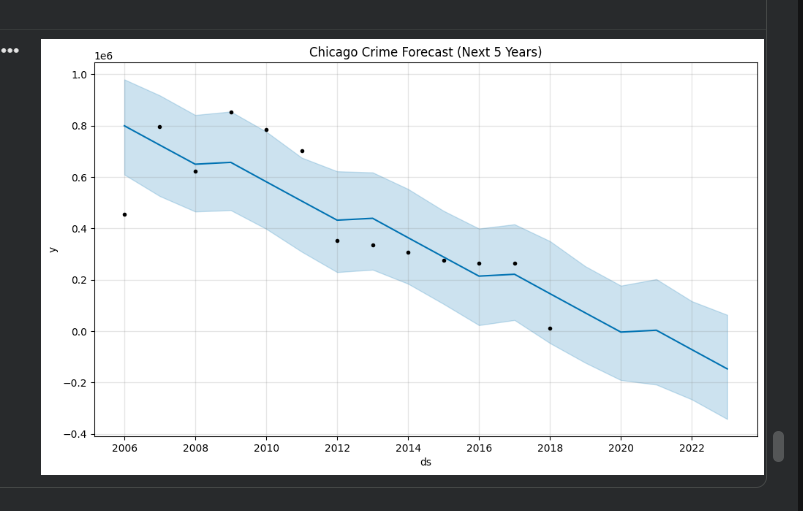

# 📊 Chicago Crime Rate Forecasting – Project Report

## 📌 Project Summary
This project analyzes historical crime data from the city of Chicago and applies **time series forecasting** techniques to understand past crime patterns and predict future trends.

The focus of this work is not only on building a forecasting model, but also on deriving **actionable insights** that can support law enforcement planning, public safety strategies, and policy decisions.

---

## 🔍 Problem Statement
Urban crime affects public safety, resource allocation, and city governance.  
Understanding **how crime changes over time** is critical for proactive decision-making.

This project aims to:
- Analyze historical crime trends
- Identify seasonal and long-term patterns
- Forecast future crime rates using time series models

---

## 🛠 Methodology Overview
1. Data collection from Chicago Open Data Portal  
2. Data cleaning and preprocessing  
3. Aggregation of crime records at monthly and yearly levels  
4. Exploratory Data Analysis (EDA)  
5. Time series forecasting using Prophet  
6. Visualization and interpretation of results  

---

## 📈 Visual Analysis & Insights

### 1️⃣ Total Crimes per Year

**Insight:**
- Crime levels increased sharply in early years
- A significant decline is observed after 2011
- Indicates impact of policy changes, enforcement strategies, or social factors

---

### 2️⃣ Monthly Crime Trend

**Insight:**
- Strong seasonal patterns are visible
- Crime peaks during certain months every year
- Monthly aggregation helps stabilize noisy daily crime data

---

### 3️⃣ Monthly Crime Forecast (Prophet Model)

**Insight:**
- Prophet captures both trend and seasonality effectively
- Confidence intervals reflect uncertainty in long-term predictions
- Model aligns well with historical observations

---

### 4️⃣ Crime Forecast for Next 5 Years

**Insight:**
- Forecast suggests a gradual decline in crime volume
- Useful for long-term planning and policy formulation
- Highlights how forecasting can support preventive strategies

---

## 🧠 Key Learnings
- Crime data exhibits clear temporal patterns
- Monthly-level aggregation improves forecasting performance
- Time series forecasting transforms historical data into future insights
- Visualization is critical for explaining results to non-technical stakeholders

---

## ⚠️ Limitations
- External factors like economic conditions or pandemics are not included
- Forecasting is performed at overall crime level, not category-wise
- Model accuracy metrics can be added for deeper evaluation

---

## 🎯 Business & Practical Impact
- Supports data-driven policing strategies
- Helps city planners anticipate high-risk periods
- Demonstrates real-world application of time series analysis
- Useful for public safety and smart city initiatives

---

## 📌 Conclusion
This project demonstrates an end-to-end analytical workflow — from raw data to interpretable forecasts.  
By combining **data preprocessing, visualization, and time series modeling**, the project showcases how analytics can drive informed decision-making in urban safety management.
